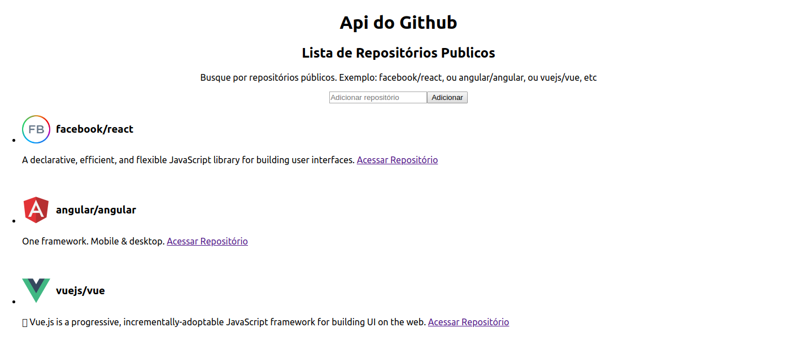

# Atividade de Arquitetura de Software 

## Esta aplicação realiza buscas por repositórios do github utilizando a própria api do github e adiciona esses repositórios em uma lista.

Com o yarn instalado, e o projeto baixado, primeiramente instale as dependências rodando somente o seguinte comando

### `yarn`

Para rodar a aplicação execute o comando

### `yarn start`

Que irá rodar a apicação no the development\
Abra [http://localhost:3000](http://localhost:3000) para ver no browser.

